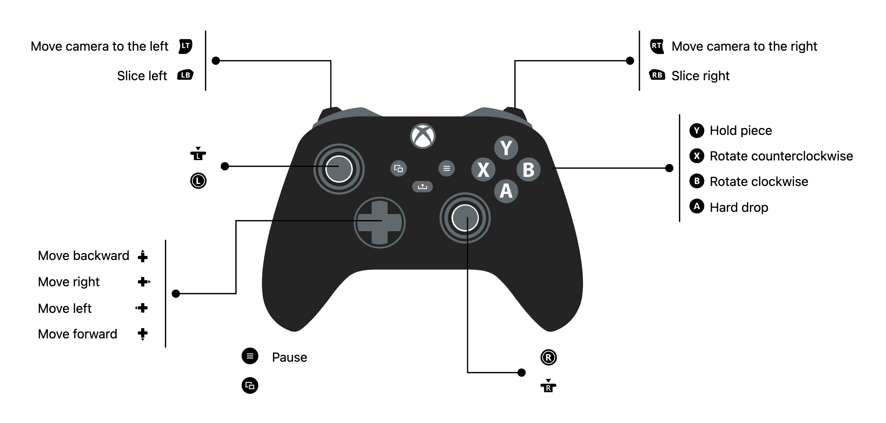

## Purpose

This project is developed purely for fun and as a hobby.
The main purpose is to experiment and gain hands-on experience with various technologies. It serves as a playground for trying out new ideas and concepts without any particular end goal or specific audience in mind.

As this is a personal project, contributions are not expected. However, if you find something interesting or have suggestions, feel free to reach out.

# How to play

You will need a controller (any keyboard binding is just for debugging purpose).

  
  
<em><a href="https://www.padcrafter.com/?templates=tetris-d&rightTrigger=Move+camera+to+the+right&plat=0&leftTrigger=Move+camera+to+the+left&aButton=Hard+drop&bButton=Rotate+clockwise&xButton=Rotate+counterclockwise&yButton=Hold+piece&startButton=Pause&dpadRight=Move+right&dpadLeft=Move+left&dpadDown=Move+forward&dpadUp=Move+backward&col=%23242424%2C%23606A6E%2C%23FFFFFF&rightBumper=Slice+right&leftBumper=Slice+left#">Gamepad schema</a></em>

